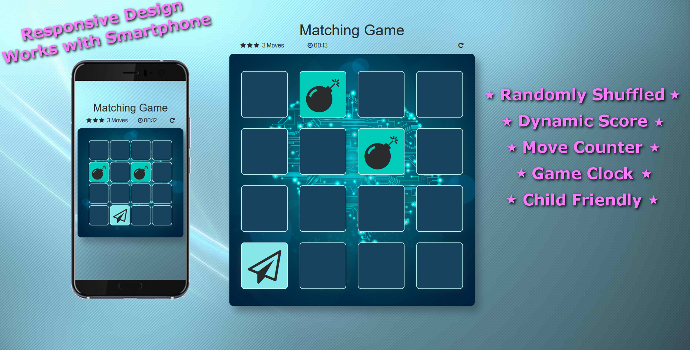

# Matching Memory Game

## About:
This Matching Game was made for a Front-End Developing project for a Udacity Intro to Programming class. The project used starter code provided to students by Udacity, containing only HTML and CSS. I added JavaScript to create the core functioning of the game, added various CSS classes for responsive scaling and animations, and added a modal to the HTML while removing unnecessary elements. 
This is my first project done using JavaScript and jQuery, so there are likely ways to make the code more concise and efficient. Regardless, I learned, and struggled, a lot in building this project and feel more confident in my JS abilities. 

## Instructions:
To play, simply open "index.html" in any web browser. Click the cards to flip them. When a second card is flipped, the two cards will be compared. If they are a match, then they will turn green and stay flipped. If not, they are flipped back over. Match all of the cards to win.

## Dependencies:
This game has dependencies on the Bootstrap, jQuery, and Font Awesome libraries.
* Bootstrap: https://getbootstrap.com/
* jQuery: https://jquery.com/
* Font Awesome: http://fontawesome.io/
